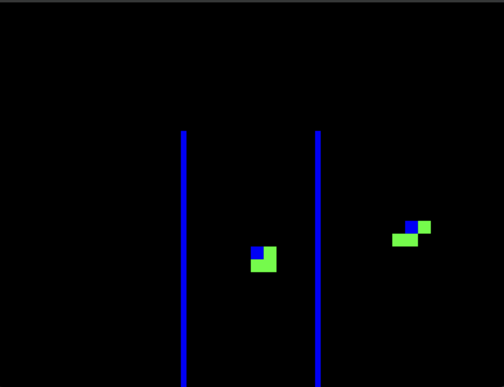
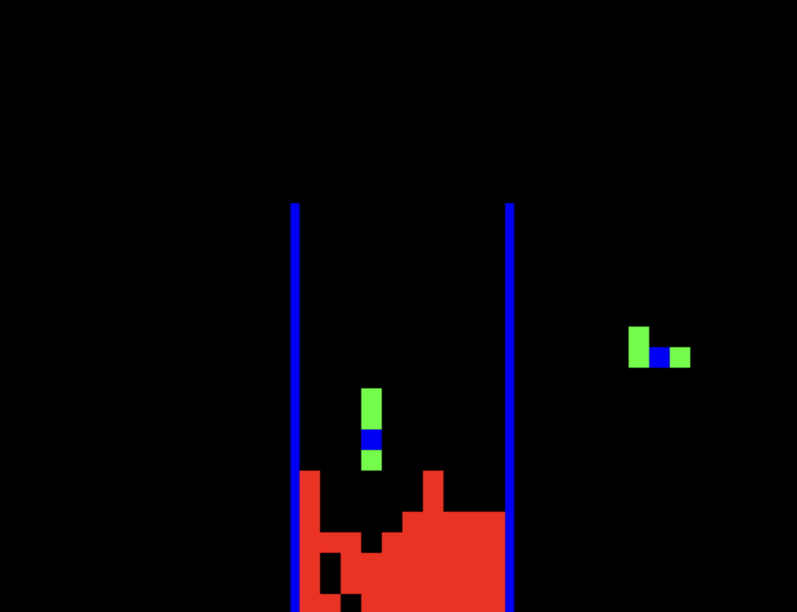

# Tetris 

Tetris written in C++ using SDL2

## Prerequisites
- ```g++```
- ```SDL_2```
- ```SDL2_gfx```

## Building the Game 
To build the game, edit the Makefile, then run ```make clean && make ```.

## Running the Game
To run the program: ```make run ``` or ```./tetris```

## Keys 
|          |          | 
|----------|----------|
| Esc      | Quit the Game | 
|z | Rotate piece |
|x | Drop Piece |
| Left, Right, Down | As it says  |


## Cleaning Up 
To clean up build artifacts, run: 
```make clean ```


## Gameplay 
<div style="text-align: center;">
  
  <p><em>Figure 1: Start of the game</em></p>
</div>
<div style="text-align: center;">
  
  <p><em>Figure 2: Gameplay </em></p>
</div>